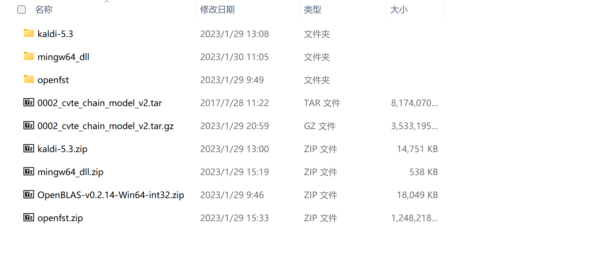
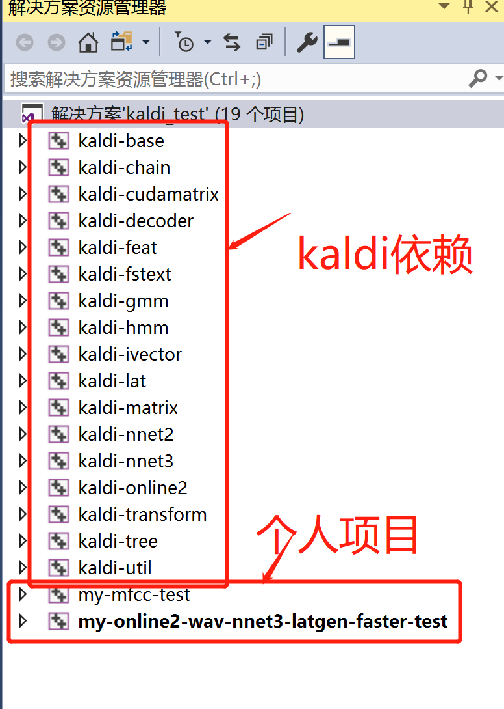
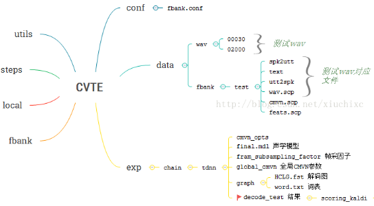

##### ps: 由于笔记本配置不满足cvte模型运行的最低要求，暂时搁置这一部分工作

#####       目前完成kaldiwindows平台的编译，compute-mfcc-feat项目改造，测试

##### 	  online2-wav-nnet3-latgen-faster 改造运行cvte模型。


# kaldi windows编译

* 参考kaldi官方文档 https://github.com/kaldi-asr/kaldi#readme
* 注意最新的5.4版本添加了portaudio的集成，需要下载配置portaudio库，不想折腾的话直接拉取5.3的分支。
* 按官方步骤配置 openfst 、openBLAS、cmake、git  程序运行时还需要mingw64.dll 



* 编译完成之后，创建自己的项目

  kaldi的相关依赖

  kaldi/src

  kaldi/windows下的三个配置文件




* 在windows下使用kaldi，可以根据 kaldi/egs/目录下的各种用例中的run.sh找到其调用的子项目，再根据子项目源码改造自己的项目

## kaldi调用cvte模型

* cvte文件结构




#### linux下的调用命令及参数


```shell
## online2-wav-nnet3-latgen-faster 调用cvte模型
 ./online2-wav-nnet3-latgen-faster 
 	--do-endpointing=false 
 	--online=false 
 	--feature-type=fbank 
 	--fbank-config=../../egs/cvte/s5/conf/fbank.conf 
 	--max-active=7000 
 	--beam=15.0 
 	--lattice-beam=6.0 
 	--acoustic-scale=1.0 
 	--word-symbol-table=../../egs/cvte/s5/exp/chain/tdnn/graph/words.txt
 	../../egs/cvte/s5/exp/chain/tdnn/final.mdl
 	../../egs/cvte/s5/exp/chain/tdnn/graph/HCLG.fst
 	' utter1 utter1|' 
 	'scp:echo utter1 ../.././online2-wav-nnet3-latgen-faster --do-endpointing=false --online=false --feature-type=fbank --fbank-config=../../egs/cvte/s5/conf/fbank.conf --max-active=7000 --beam=15.0 --lattice-beam=6.0 --acoustic-scale=1.0 --word-symbol-table=../../egs/cvte/s5/exp/chain/tdnn/graph/words.txt ../../egs/cvte/s5/exp/chain/tdnn/final.mdl ../../egs/cvte/s5/exp/chain/tdnn/graph/HCLG.fst 'ark:echo utter1 utter1|' 'scp:echo utter1 /tmp/test1.wav|' ark:/dev/null|'
 	ark:/dev/null
```

#### windows 下调用命令及参数

```shell
.\my-online2-wav-nnet3-latgen-faster-test.exe --do-endpointing=false --online=false --feature-type=fbank --fbank-config=E:\project_cpp\kaldi_build\kaldi-5.3\egs\cvte\s5\conf\fbank.conf --max-active=7000 --beam=15.0 --lattice-beam=6.0 --acoustic-scale=1.0 --word-symbol-table=E:\project_cpp\kaldi_build\kaldi-5.3\egs\cvte\s5\exp\chain\tdnn\graph\words.txt E:\project_cpp\kaldi_build\kaldi-5.3\egs\cvte\s5\exp\chain\tdnn\final.mdl E:\project_cpp\kaldi_build\kaldi-5.3\egs\cvte\s5\exp\chain\tdnn\graph\HCLG.fst  E:\project_cpp\kaldi_build\kaldi-5.3\egs\cvte\s5\data\wav\00030\2017_03_07_16.57.22_1175.wav
```


#### online2-wav-nnet3-latgen-faster 使用说明及参数介绍mark

```shell
## online2-wav-nnet3-latgen-faster 使用说明

Reads in wav file(s) and simulates online decoding with neural nets
(nnet3 setup), with optional iVector-based speaker adaptation and
optional endpointing.  Note: some configuration values and inputs are
set via config files whose filenames are passed as options

Usage: online2-wav-nnet3-latgen-faster [options] <nnet3-in> <fst-in> <spk2utt-rspecifier> <wav-rspecifier> <lattice-wspecifier>
The spk2utt-rspecifier can just be <utterance-id> <utterance-id> if
you want to decode utterance by utterance.

Options:
  --acoustic-scale            : Scaling factor for acoustic log-likelihoods (float, default = 0.1)
  --add-pitch                 : Append pitch features to raw MFCC/PLP/filterbank features [but not for iVector extraction] (bool, default = false)
  --beam                      : Decoding beam.  Larger->slower, more accurate. (float, default = 16)
  --beam-delta                : Increment used in decoding-- this parameter is obscure and relates to a speedup in the way the max-active constraint is applied.  Larger is more accurate. (float, default = 0.5)
  --chunk-length              : Length of chunk size in seconds, that we process.  Set to <= 0 to use all input in one chunk. (float, default = 0.18)
  --computation.debug         : If true, turn on debug for the neural net computation (very verbose!) Will be turned on regardless if --verbose >= 5 (bool, default = false)
  --debug-computation         : If true, turn on debug for the actual computation (very verbose!) (bool, default = false)
  --delta                     : Tolerance used in determinization (float, default = 0.000976563)
  --determinize-lattice       : If true, determinize the lattice (lattice-determinization, keeping only best pdf-sequence for each word-sequence). (bool, default = true)
  --do-endpointing            : If true, apply endpoint detection (bool, default = false)
  --endpoint.rule1.max-relative-cost : This endpointing rule requires relative-cost of final-states to be <= this value (describes how good the probability of final-states is). (float, default = inf)
  --endpoint.rule1.min-trailing-silence : This endpointing rule requires duration of trailing silence(in seconds) to be >= this value. (float, default = 5)
  --endpoint.rule1.min-utterance-length : This endpointing rule requires utterance-length (in seconds) to be >= this value. (float, default = 0)
  --endpoint.rule1.must-contain-nonsilence : If true, for this endpointing rule to apply there mustbe nonsilence in the best-path traceback. (bool, default = false)
  --endpoint.rule2.max-relative-cost : This endpointing rule requires relative-cost of final-states to be <= this value (describes how good the probability of final-states is). (float, default = 2)
  --endpoint.rule2.min-trailing-silence : This endpointing rule requires duration of trailing silence(in seconds) to be >= this value. (float, default = 0.5)
  --endpoint.rule2.min-utterance-length : This endpointing rule requires utterance-length (in seconds) to be >= this value. (float, default = 0)
  --endpoint.rule2.must-contain-nonsilence : If true, for this endpointing rule to apply there mustbe nonsilence in the best-path traceback. (bool, default = true)
  --endpoint.rule3.max-relative-cost : This endpointing rule requires relative-cost of final-states to be <= this value (describes how good the probability of final-states is). (float, default = 8)
  --endpoint.rule3.min-trailing-silence : This endpointing rule requires duration of trailing silence(in seconds) to be >= this value. (float, default = 1)
  --endpoint.rule3.min-utterance-length : This endpointing rule requires utterance-length (in seconds) to be >= this value. (float, default = 0)
  --endpoint.rule3.must-contain-nonsilence : If true, for this endpointing rule to apply there mustbe nonsilence in the best-path traceback. (bool, default = true)
  --endpoint.rule4.max-relative-cost : This endpointing rule requires relative-cost of final-states to be <= this value (describes how good the probability of final-states is). (float, default = inf)
  --endpoint.rule4.min-trailing-silence : This endpointing rule requires duration of trailing silence(in seconds) to be >= this value. (float, default = 2)
  --endpoint.rule4.min-utterance-length : This endpointing rule requires utterance-length (in seconds) to be >= this value. (float, default = 0)
  --endpoint.rule4.must-contain-nonsilence : If true, for this endpointing rule to apply there mustbe nonsilence in the best-path traceback. (bool, default = true)
  --endpoint.rule5.max-relative-cost : This endpointing rule requires relative-cost of final-states to be <= this value (describes how good the probability of final-states is). (float, default = inf)
  --endpoint.rule5.min-trailing-silence : This endpointing rule requires duration of trailing silence(in seconds) to be >= this value. (float, default = 0)
  --endpoint.rule5.min-utterance-length : This endpointing rule requires utterance-length (in seconds) to be >= this value. (float, default = 20)
  --endpoint.rule5.must-contain-nonsilence : If true, for this endpointing rule to apply there mustbe nonsilence in the best-path traceback. (bool, default = false)
  --endpoint.silence-phones   : List of phones that are considered to be silence phones by the endpointing code. (string, default = "")
  --extra-left-context-initial : Extra left context to use at the first frame of an utterance (note: this will just consist of repeats of the first frame, and should not usually be necessary. (int, default = 0)
  --fbank-config              : Configuration file for filterbank features (e.g. conf/fbank.conf) (string, default = "")
  --feature-type              : Base feature type [mfcc, plp, fbank] (string, default = "mfcc")
  --frame-subsampling-factor  : Required if the frame-rate of the output (e.g. in 'chain' models) is less than the frame-rate of the original alignment. (int, default = 1)
  --frames-per-chunk          : Number of frames in each chunk that is separately evaluated by the neural net.  Measured before any subsampling, if the --frame-subsampling-factor options is used (i.e. counts input frames.  This is only advisory (may be rounded up if needed. (int, default = 20)
  --hash-ratio                : Setting used in decoder to control hash behavior (float, default = 2)
  --ivector-extraction-config : Configuration file for online iVector extraction, see class OnlineIvectorExtractionConfig in the code (string, default = "")
  --ivector-silence-weighting.max-state-duration : (RE weighting in iVector estimation for online decoding) Maximum allowed duration of a single transition-id; runs with durations longer than this will be weighted down to the silence-weight. (float, default = -1)
  --ivector-silence-weighting.silence-phones : (RE weighting in iVector estimation for online decoding) List of integer ids of silence phones, separated by colons (or commas).  Data that (according to the traceback of the decoder) corresponds to these phones will be downweighted by --silence-weight. (string, default = "")
  --ivector-silence-weighting.silence-weight : (RE weighting in iVector estimation for online decoding) Weighting factor for frames that the decoder trace-back identifies as silence; only relevant if the --silence-phones option is set. (float, default = 1)
  --lattice-beam              : Lattice generation beam.  Larger->slower, and deeper lattices (float, default = 10)
  --max-active                : Decoder max active states.  Larger->slower; more accurate (int, default = 2147483647)
  --max-mem                   : Maximum approximate memory usage in determinization (real usage might be many times this). (int, default = 50000000)
  --mfcc-config               : Configuration file for MFCC features (e.g. conf/mfcc.conf) (string, default = "")
  --min-active                : Decoder minimum #active states. (int, default = 200)
  --minimize                  : If true, push and minimize after determinization. (bool, default = false)
  --num-threads-startup       : Number of threads used when initializing iVector extractor. (int, default = 8)
  --online                    : You can set this to false to disable online iVector estimation and have all the data for each utterance used, even at utterance start.  This is useful where you just want the best results and don't care about online operation.  Setting this to false has the same effect as setting --use-most-recent-ivector=true and --greedy-ivector-extractor=true in the file given to --ivector-extraction-config, and --chunk-length=-1. (bool, default = true)
  --online-pitch-config       : Configuration file for online pitch features, if --add-pitch=true (e.g. conf/online_pitch.conf) (string, default = "")
  --optimization.allocate-from-other : Instead of deleting a matrix of a given size and then allocating a matrix of the same size, allow re-use of that memory (bool, default = true)
  --optimization.allow-left-merge : Set to false to disable left-merging of variables in remove-assignments (obscure option) (bool, default = true)
  --optimization.allow-right-merge : Set to false to disable right-merging of variables in remove-assignments (obscure option) (bool, default = true)
  --optimization.backprop-in-place : Set to false to disable optimization that allows in-place backprop (bool, default = true)
  --optimization.consolidate-model-update : Set to false to disable optimization that consolidates the model-update phase of backprop (e.g. for recurrent architectures (bool, default = true)
  --optimization.convert-addition : Set to false to disable the optimization that converts Add commands into Copy commands wherever possible. (bool, default = true)
  --optimization.initialize-undefined : Set to false to disable optimization that avoids redundant zeroing (bool, default = true)
  --optimization.max-deriv-time : You can set this to the maximum t value that you want derivatives to be computed at when updating the model.  This is an optimization that saves time in the backprop phase for recurrent frameworks (int, default = 2147483647)
  --optimization.max-deriv-time-relative : An alternative mechanism for setting the --max-deriv-time, suitable for situations where the length of the egs is variable.  If set, it is equivalent to setting the --max-deriv-time to this value plus the largest 't' value in any 'output' node of the computation request. (int, default = 2147483647)
  --optimization.min-deriv-time : You can set this to the minimum t value that you want derivatives to be computed at when updating the model.  This is an optimization that saves time in the backprop phase for recurrent frameworks (int, default = -2147483648)
  --optimization.move-sizing-commands : Set to false to disable optimization that moves matrix allocation and deallocation commands to conserve memory. (bool, default = true)
  --optimization.optimize     : Set this to false to turn off all optimizations (bool, default = true)
  --optimization.optimize-row-ops : Set to false to disable certain optimizations that act on operations of type *Row*. (bool, default = true)
  --optimization.propagate-in-place : Set to false to disable optimization that allows in-place propagation (bool, default = true)
  --optimization.remove-assignments : Set to false to disable optimization that removes redundant assignments (bool, default = true)
  --optimization.snip-row-ops : Set this to false to disable an optimization that reduces the size of certain per-row operations (bool, default = true)
  --phone-determinize         : If true, do an initial pass of determinization on both phones and words (see also --word-determinize) (bool, default = true)
  --plp-config                : Configuration file for PLP features (e.g. conf/plp.conf) (string, default = "")
  --prune-interval            : Interval (in frames) at which to prune tokens (int, default = 25)
  --word-determinize          : If true, do a second pass of determinization on words only (see also --phone-determinize) (bool, default = true)
  --word-symbol-table         : Symbol table for words [for debug output] (string, default = "")

Standard options:
  --config                    : Configuration file to read (this option may be repeated) (string, default = "")
  --help                      : Print out usage message (bool, default = false)
  --print-args                : Print the command line arguments (to stderr) (bool, default = true)
  --verbose                   : Verbose level (higher->more logging) (int, default = 0)
```


